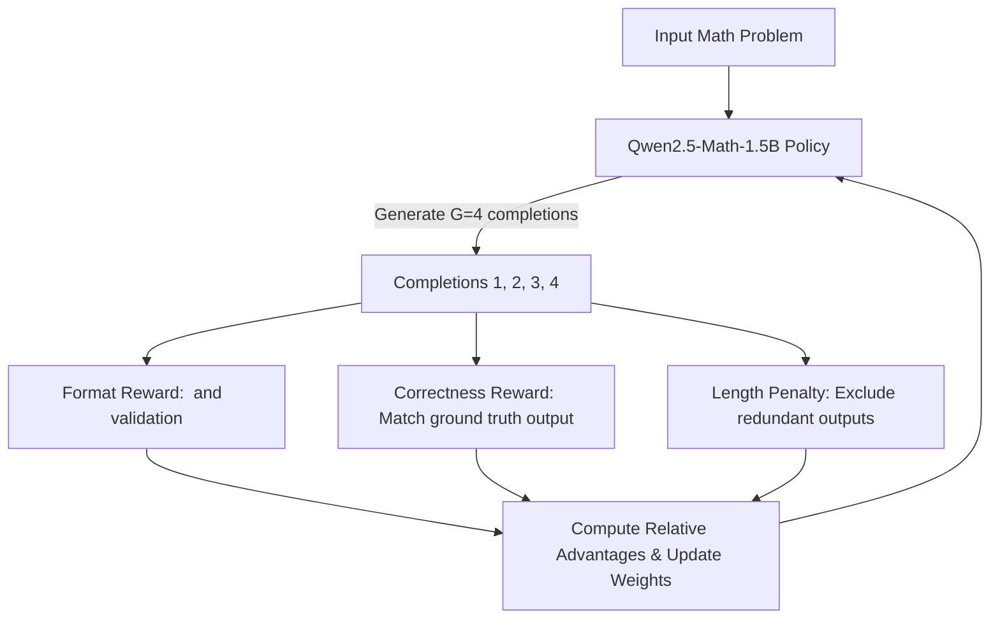

# DeepSeek-R1-Mini-T4: GRPO Reinforcement Learning Alignment Pipeline

This repository contains a complete pipeline to train and evaluate a reasoning LLM using **GRPO (Group Relative Policy Optimization)** on resource-constrained hardware (e.g., Kaggle's free Tesla T4 GPUs). 

It implements a DeepSeek-R1 style reinforcement learning loop that teaches a 1.5B parameters model to reason step-by-step using `<reasoning>` and `<answer>` tags, optimized for training and inference stability.

---

## 🚀 Key Features

*   **GRPO Training Implementation**: Direct policy reinforcement optimization using custom rule-based rewards without requiring a Critic model (saving up to 50% VRAM).
*   **Multi-Aspect Reward Design**:
    1.  `format_reward`: Enforces thinking layout containing strict `<reasoning>` and `<answer>` blocks.
    2.  `correctness_reward`: Parses mathematical responses and validates calculations against ground truth (GSM8K).
    3.  `length_penalty`: Mitigates "thought-length hacking" (penalizes redundant loops).
*   **VRAM-Optimized Environment Setup**: Configured to run on standard T4 GPUs by disabling memory-heavy vLLM dependencies, enabling gradient checkpointing, and using `Unsloth` 4-bit quantization.
*   **Automated Cloud Execution**: Includes wrapper scripts to convert Python code into Jupyter Notebooks and programmatically deploy them to Kaggle Kernels.

---

## 📐 GRPO Architecture



---

## 📁 Repository Structure

```
├── grpo_trainer.py       # Main GRPO training script using TRL and Unsloth
├── push_kernel.py        # Converts training script to Notebook and pushes to Kaggle
├── inference_test.py     # Inference evaluation script loading the merged model
├── push_inference.py     # Deploys inference test to Kaggle referencing the training outputs
└── .gitignore            # Git exclusion rules
```

---

## 🛠️ Usage Instructions

### 1. Prerequisite: Kaggle CLI
Install the Kaggle CLI and set up your authentication key:
```bash
pip install kaggle
mkdir -p ~/.kaggle
echo '{"username":"YOUR_USERNAME","key":"YOUR_KEY"}' > ~/.kaggle/kaggle.json
chmod 600 ~/.kaggle/kaggle.json
```

### 2. Triggering the Training Job
Run the push script to convert `grpo_trainer.py` to a Kaggle Notebook format and deploy it to a remote GPU container:
```bash
python3 push_kernel.py
```
Monitor the run using:
```bash
kaggle kernels status YOUR_USERNAME/grpo-deepseek-r1-t4
```

### 3. Running Inference Verification
Once the training kernel completes and saves the merged weights, deploy the inference evaluation:
```bash
python3 push_inference.py
```

---

## 🎯 Verification Results

During testing, the aligned `Qwen2.5-Math-1.5B` model generated perfect reasoning trajectories. Here is a sample evaluation output:

### Problem: Algebra Equation
*   **Question**: `Solve for x: 3x + 7 = 22. Provide the numeric value.`
*   **Generated Response**:
    ```html
    To solve the equation 3x + 7 = 22 for x, we will follow these steps:
    
    1. Isolate the term with the variable x by subtracting 7 from both sides:
       3x + 7 - 7 = 22 - 7
       3x = 15
       
    2. Solve for x by dividing both sides of the equation by 3:
       3x/3 = 15/3
       x = 5
       
    So, the solution to the equation is \boxed{5}.
    ```
